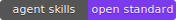

# agentskills-subcommand-dispatch

[](https://github.com/blackwell-systems)
[](https://agentskills.io)

The [Agent Skills](https://agentskills.io) spec defines a Resources tier for on-demand reference files but leaves loading to convention - the model decides when to load them. In practice, skills with multiple subcommand families face an impossible tradeoff: load all references upfront (wastes context budget on every invocation) or rely on the model to load selectively (misses files, improvises on logic it doesn't have).

This repo fixes that for dispatch-time subcommand routing. Skills declare which reference files to load for which subcommands. A pre-invocation hook loads them before the model starts - no model judgment required.

Every major Agent Skills-compatible platform has independently built a pre-invocation hook: `UserPromptSubmit` (Claude Code), `BeforeAgent` (Gemini CLI), `UserPromptSubmit` (OpenAI Codex), `beforeSubmitPrompt` (Cursor), `chat.message` (OpenCode). The ecosystem has converged on this pattern. `triggers:` gives skill authors a single declaration that all conforming platforms can honor - rather than each platform requiring its own wiring.

**Scope: dispatch-time subcommand triggers only.** If you know at invocation time which subcommand is being called, this handles it deterministically. Mid-execution references that depend on runtime state (e.g. failure routing after agents report back) are out of scope - the hook fires before execution begins.

> Works today via YAML extensibility - platforms that understand `triggers:` act on it, others ignore it. The proposal asks the spec to formally recognize `triggers:` as a top-level field. Reference implementation for Claude Code (`UserPromptSubmit`); the same pattern applies to Gemini CLI (`BeforeAgent`), OpenAI Codex (`UserPromptSubmit`), Cursor (`beforeSubmitPrompt`), and OpenCode (`chat.message`).

## How it works

Skills add `triggers:` to their YAML frontmatter. Each trigger maps a regex to a reference file. When the user's prompt matches, the reference loads automatically.

Two layers, same trigger definitions:

**Layer 1 -- Script (any agent).** A `scripts/inject-context` script ships with the skill. The model runs it before executing:

```bash
bash scripts/inject-context "/saw program execute add caching"
# outputs contents of references/program-flow.md
```

One line in `SKILL.md`: "run `scripts/inject-context` with the user's prompt before proceeding." The model still decides what string to pass - this is model-initiated, not deterministically enforced. But it eliminates manual routing tables in SKILL.md and reduces accidental omissions.

**Layer 2 -- Hook (platform-native).** A pre-invocation hook runs the same script before the model sees the prompt. No model decision. The reference is in context when the model starts. Deterministic. Reference implementation ships for Claude Code (`UserPromptSubmit`); the same pattern applies to Gemini CLI (`BeforeAgent`), OpenAI Codex (`UserPromptSubmit`), Cursor (`beforeSubmitPrompt`), and OpenCode (`chat.message`).

## Trigger Definitions

Skills declare triggers in YAML frontmatter using a top-level `triggers:` field:

```yaml
---
name: my-skill
description: Does things
triggers:
  - match: "^/my-skill subcommand"
    inject: references/subcommand-flow.md
  - match: "^/my-skill other-subcommand"
    inject: references/other-flow.md
---
```

- `match`: regex pattern tested against the full prompt text
- `inject`: path relative to the skill directory
- Multiple matches -> all matching references injected (concatenated)
- No match -> no injection, zero overhead

**Subcommand-anchored patterns only.** Pre-invocation hooks fire after skill body expansion - the full `SKILL.md` content is in the prompt, not just what the user typed. Keyword triggers like `failure|blocked` match against the skill's own instructions and fire on every invocation. Use patterns anchored to the invocation prefix (e.g. `^/saw program`, `^/saw amend`) that cannot appear in the skill body. Mid-execution references that depend on runtime state (failure routing, post-merge integration) are intentionally out of scope - they require runtime context that is not available at invocation time.

### Trigger Format Constraints

The `triggers` field uses a **portable subset** of YAML as a spec conformance requirement, ensuring reliable parsing across implementations without requiring a full YAML library:

- Flat list of `{match, inject}` entries only
- Single-line scalar values -- no multi-line strings, no block scalars (`|`, `>`)
- No YAML anchors (`&`), aliases (`*`), or tags (`!!`)
- No nested objects within trigger entries
- `match` and `inject` on consecutive lines within each list item
- Values may be quoted (`"..."`) or unquoted

This is a deliberate interoperability boundary. The reference parser (`scripts/inject-context`) uses awk to extract triggers without external dependencies. Implementations that use a full YAML parser will handle this subset correctly; implementations that use lightweight parsing (awk, regex, line-oriented) can also conform. The constraint ensures both approaches produce identical results.

Triggers that do not conform to the portable format (multi-line patterns, anchored references) may not be correctly parsed by lightweight implementations and should be avoided for cross-platform compatibility.

## Installation

### The injection script (any skill)

Copy `scripts/inject-context` into your skill's `scripts/` directory:

```bash
cp scripts/inject-context ~/.agents/skills/my-skill/scripts/
chmod +x ~/.agents/skills/my-skill/scripts/inject-context
```

Add `triggers:` to your skill's frontmatter, and add this to your `SKILL.md` instructions:

```markdown
Before executing any subcommand, run:
  bash scripts/inject-context "<user prompt>"
and incorporate the output as context.
```

### The platform hook (optional, deterministic enforcement)

```bash
# Install the hook script
cp hooks/inject_skill_context ~/.local/bin/
chmod +x ~/.local/bin/inject_skill_context
```

Add to `~/.claude/settings.json`:

```json
{
  "hooks": {
    "UserPromptSubmit": [
      {
        "hooks": [
          {
            "type": "command",
            "command": "inject_skill_context"
          }
        ]
      }
    ]
  }
}
```

The hook iterates all skill directories (`~/.claude/skills/`, `~/.agents/skills/`) and delegates to each skill's `scripts/inject-context`. Adding a new skill requires zero hook changes.

## Validating Triggers

Use `scripts/validate-triggers` to check trigger patterns for false-positive risk before deploying:

```bash
bash scripts/validate-triggers path/to/skill/
```

The script tests each trigger regex against the skill's own SKILL.md body. Patterns that match the body will fire on every invocation when a pre-invocation hook receives the expanded prompt:

```
$ bash scripts/validate-triggers examples/saw/
OK    ^/saw program -> references/program-flow.md
OK    ^/saw amend -> references/amend-flow.md

2 triggers checked, 0 false-positive risk(s)
```

A failing check looks like:

```
FAIL  failure|blocked -> references/bad.md
      Pattern matches the skill body - will fire on every invocation
      First match: 4:When an agent reports failure or becomes blocked...
```

Run this after adding or changing triggers. Exit code 0 means clean, 1 means false-positive risk detected.

## Redundancy Model

All three layers are active simultaneously:

| Layer | Mechanism | Platform | Enforcement |
|-------|-----------|----------|-------------|
| Hook | `UserPromptSubmit` | Claude Code | Deterministic (pre-model) |
| Hook | `BeforeAgent` | Gemini CLI | Deterministic (pre-model) |
| Hook | `UserPromptSubmit` | OpenAI Codex | Deterministic (pre-model) |
| Hook | `beforeSubmitPrompt` | Cursor | Deterministic (pre-model) |
| Hook | `chat.message` | OpenCode | Deterministic (pre-model) |
| Script | `scripts/inject-context` | Any agent with Bash | Model-initiated |
| Prose routing | Explicit routing instructions in SKILL.md | Any agent | Skill-author-directed |

Users get the best available layer. No regression at any level.

## Spec Alignment

This project uses existing Agent Skills conventions:
- `scripts/` directory for executable code ([spec](https://agentskills.io/skill-creation/using-scripts))
- `references/` directory for on-demand content ([spec](https://agentskills.io/specification#references))

**Today:** `triggers:` is a top-level frontmatter field. The spec does not currently define it, but YAML parsers ignore unknown fields - platforms that understand `triggers:` act on it; those that don't ignore it with no behavior change. The alternative (`metadata: triggers:`) is a poor fit because the spec defines `metadata:` as a map of string key-value pairs, and `triggers:` requires structured list data.

**The proposal:** Ask the spec to formally recognize `triggers:` as a top-level field intended for platform consumption - distinct from `metadata:` (passive author-defined data) because `triggers:` is read by platform hooks before the model runs, not passed through to the model as context.

The constrained trigger format (see [Trigger Format Constraints](#trigger-format-constraints)) is a deliberate portability decision: any platform can implement a conforming parser without a YAML library. This keeps the standard accessible to implementations in any language or runtime.

## Progressive Disclosure Model

The Agent Skills spec defines three progressive disclosure tiers. This project adds a Discovery layer and provides deterministic loading for the Resources tier:

| Layer | Spec name | What | When loaded |
|-------|-----------|------|-------------|
| Discovery | *(extension)* | Skill index in project config (`CLAUDE.md`, `.cursorrules`, etc.) | Session start (always in context) |
| 1 | **Metadata** | `name` + `description` from frontmatter | Session start (catalog) |
| 2 | **Instructions** | Full `SKILL.md` body | Skill activation |
| 3 | **Resources** | Reference files via `triggers:` | **Subcommand dispatch** (this project) |

See [`docs/tier-0-discovery.md`](docs/tier-0-discovery.md) for the full Tier 0 pattern.

## Example

See [`examples/saw/`](examples/saw/) for the Scout-and-Wave skill's trigger configuration.

## License

MIT
